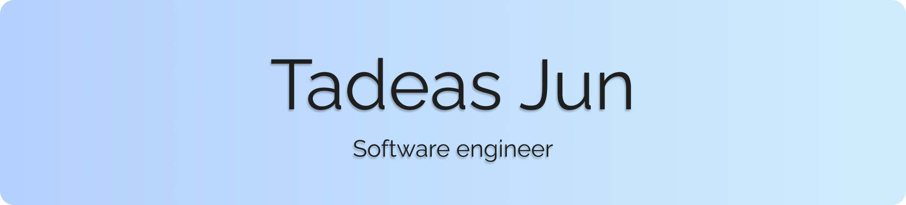

👋 Hiya, I'm Tadeas Jun!

I'm a fullstack developer with around 7 years of experience, specializing in websites and web apps! Other than that, I also make Discord bots, and I'm writer and world designer.

I'm available for freelance work in the areas mentioned in the **My skills** section below. If you want to reach out, feel free to do so via *contact@tadeasjun.com*. You can also check out my [portfolio website](https://www.tadeasjun.com/).

If you're interested in some of my work, I'd love it if you'd check out my CV, available as a .pdf file on [website](https://www.tadeasjun.com/assets/pdf/tadeasjun_cv_en.pdf) (or in [Czech](https://www.tadeasjun.com/assets/pdf/tadeasjun_cv_cs.pdf))! Alternatively, you can read up on my skills and projects below.

&nbsp; &nbsp;

**🪄  My skills**
- Fullstack web development
- Node.js development
- React development
- Technical & academic writing
- Translation (Czech & English)
- Creative writing
- World design

&nbsp; &nbsp;

**🏆  My projects**
Most of my personal and professional projects are listed on [my portfolio website](https://tadeasjun.com). Here are some of my favorite personal ones:

- *Art Prompts* - a web app helping artist find inspiration for drawing. I designed and coded the API (Express.js) and website (around 1 000 registered users), as well as a popular Discord bot (8 000 servers). [[^]](https://artprompts.app/)
- *The Eledris Blog* - a blog focused on worldbuilding and writing. [[^]](https://eledris.com/)
- *HKSkins* - a website archiving an annotated list of skins for the video games *Hollow Knight (2017)* and *Silksong (2025)*, built using Gatsby.js, receiving around 3 000 visitors a day.
- *Wumpi* - a series of open-source Discord bots, available here on GitHub. [[^]](https://github.com/stars/Tadeas-Jun/lists/wumpi/)
- *Other small projects* - including the *Palettey* [[^]](https://github.com/Tadeas-Jun/Palettey) palette-generation bot Discord bot, the *Pride Flags & Gradients* [[^]](https://github.com/Tadeas-Jun/figma-pride) plugin for Figma, or the [czech-keywords](https://github.com/Tadeas-Jun/czech-keywords) keyword extractor written in Perl.

&nbsp; &nbsp;

**💻  The tools & tech I love**
- JavaScript
- React.js
- Node.js
- Gatsby.js
- Sass
- Discord.js
- PHP

Looking forward to hearing from you! 💖
